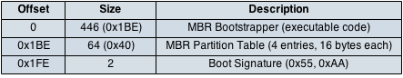
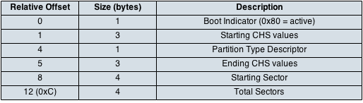
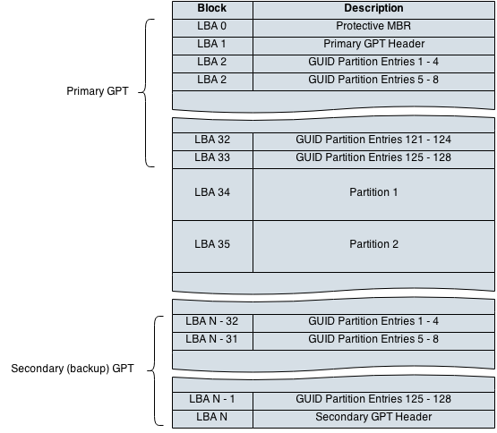
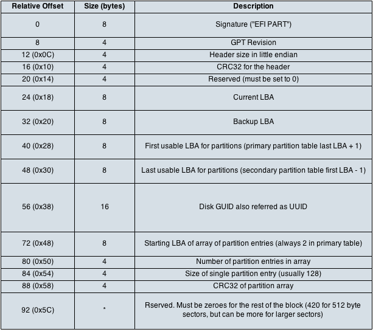
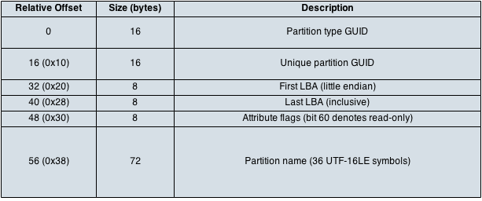

===================
Filesystem Diagrams
===================

Master Boot Record
------------------

Example::

    ✗ hexdump -C -n 512 sample_images/ntfs_mbr.vhd

    00000000  33 c0 8e d0 bc 00 7c 8e  c0 8e d8 be 00 7c bf 00  |3.....|......|..|
    00000010  06 b9 00 02 fc f3 a4 50  68 1c 06 cb fb b9 04 00  |.......Ph.......|
    00000020  bd be 07 80 7e 00 00 7c  0b 0f 85 0e 01 83 c5 10  |....~..|........|
    00000030  e2 f1 cd 18 88 56 00 55  c6 46 11 05 c6 46 10 00  |.....V.U.F...F..|
    00000040  b4 41 bb aa 55 cd 13 5d  72 0f 81 fb 55 aa 75 09  |.A..U..]r...U.u.|
    00000050  f7 c1 01 00 74 03 fe 46  10 66 60 80 7e 10 00 74  |....t..F.f`.~..t|
    00000060  26 66 68 00 00 00 00 66  ff 76 08 68 00 00 68 00  |&fh....f.v.h..h.|
    00000070  7c 68 01 00 68 10 00 b4  42 8a 56 00 8b f4 cd 13  ||h..h...B.V.....|
    00000080  9f 83 c4 10 9e eb 14 b8  01 02 bb 00 7c 8a 56 00  |............|.V.|
    00000090  8a 76 01 8a 4e 02 8a 6e  03 cd 13 66 61 73 1c fe  |.v..N..n...fas..|
    000000a0  4e 11 75 0c 80 7e 00 80  0f 84 8a 00 b2 80 eb 84  |N.u..~..........|
    000000b0  55 32 e4 8a 56 00 cd 13  5d eb 9e 81 3e fe 7d 55  |U2..V...]...>.}U|
    000000c0  aa 75 6e ff 76 00 e8 8d  00 75 17 fa b0 d1 e6 64  |.un.v....u.....d|
    000000d0  e8 83 00 b0 df e6 60 e8  7c 00 b0 ff e6 64 e8 75  |......`.|....d.u|
    000000e0  00 fb b8 00 bb cd 1a 66  23 c0 75 3b 66 81 fb 54  |.......f#.u;f..T|
    000000f0  43 50 41 75 32 81 f9 02  01 72 2c 66 68 07 bb 00  |CPAu2....r,fh...|
    00000100  00 66 68 00 02 00 00 66  68 08 00 00 00 66 53 66  |.fh....fh....fSf|
    00000110  53 66 55 66 68 00 00 00  00 66 68 00 7c 00 00 66  |SfUfh....fh.|..f|
    00000120  61 68 00 00 07 cd 1a 5a  32 f6 ea 00 7c 00 00 cd  |ah.....Z2...|...|
    00000130  18 a0 b7 07 eb 08 a0 b6  07 eb 03 a0 b5 07 32 e4  |..............2.|
    00000140  05 00 07 8b f0 ac 3c 00  74 09 bb 07 00 b4 0e cd  |......<.t.......|
    00000150  10 eb f2 f4 eb fd 2b c9  e4 64 eb 00 24 02 e0 f8  |......+..d..$...|
    00000160  24 02 c3 49 6e 76 61 6c  69 64 20 70 61 72 74 69  |$..Invalid parti|
    00000170  74 69 6f 6e 20 74 61 62  6c 65 00 45 72 72 6f 72  |tion table.Error|
    00000180  20 6c 6f 61 64 69 6e 67  20 6f 70 65 72 61 74 69  | loading operati|
    00000190  6e 67 20 73 79 73 74 65  6d 00 4d 69 73 73 69 6e  |ng system.Missin|
    000001a0  67 20 6f 70 65 72 61 74  69 6e 67 20 73 79 73 74  |g operating syst|
    000001b0  65 6d 00 00 00 63 7b 9a  83 a1 56 0d 00 00 00 02  |em...c{...V.....|
    000001c0  03 00 07 e5 25 00 80 00  00 00 00 38 00 00 00 00  |....%......8....|
    000001d0  00 00 00 00 00 00 00 00  00 00 00 00 00 00 00 00  |................|
    *
    000001f0  00 00 00 00 00 00 00 00  00 00 00 00 00 00 55 aa  |..............U.|
    00000200

MBR Partition Entry
-------------------

Example::

    % hexdump -C -s 0x1be -n 16 sample_images/ntfs_mbr.vhd

    000001be  00 02 03 00 07 e5 25 00  80 00 00 00 00 38 00 00  |......%......8..|

GUID Partition Table
--------------------

GPT Header
----------

Example::

    >>> from rawdisk.scheme.gpt import Gpt
    >>> gpt = Gpt()
    >>> gpt.load('sample_images/ntfs_primary_gpt.bin')
    >>> gpt.header.hexdump()

    00000000: 45 46 49 20 50 41 52 54  00 00 01 00 5C 00 00 00  EFI PART....\...
    00000010: 99 24 C1 58 00 00 00 00  01 00 00 00 00 00 00 00  .$.X............
    00000020: FF FF 03 00 00 00 00 00  22 00 00 00 00 00 00 00  ........".......
    00000030: DE FF 03 00 00 00 00 00  E5 66 99 AF FB 00 CD 45  .........f.....E
    00000040: BE 63 26 2D 91 88 DC E7  02 00 00 00 00 00 00 00  .c&-............
    00000050: 80 00 00 00 80 00 00 00  62 5A F4 F0              ........bZ..

    >>> gpt.header.size
    92

GPT Partition Entry
-------------------

Example::

    >>> from rawdisk.scheme.gpt import Gpt
    >>> gpt = Gpt()
    >>> gpt.load('sample_images/ntfs_primary_gpt.bin')
    >>> gpt.partition_entries[1].hexdump()

    00000000: A2 A0 D0 EB E5 B9 33 44  87 C0 68 B6 B7 26 99 C7  ......3D..h..&..
    00000010: 19 67 C5 5C 2B 2E 46 4A  B4 55 C5 C2 6E 74 67 5C  .g.\+.FJ.U..ntg\
    00000020: 80 00 01 00 00 00 00 00  7F F0 03 00 00 00 00 00  ................
    00000030: 00 00 00 00 00 00 00 00  42 00 61 00 73 00 69 00  ........B.a.s.i.
    00000040: 63 00 20 00 64 00 61 00  74 00 61 00 20 00 70 00  c. .d.a.t.a. .p.
    00000050: 61 00 72 00 74 00 69 00  74 00 69 00 6F 00 6E 00  a.r.t.i.t.i.o.n.
    00000060: 00 00 00 00 00 00 00 00  00 00 00 00 00 00 00 00  ................
    00000070: 00 00 00 00 00 00 00 00  00 00 00 00 00 00 00 00  ................
